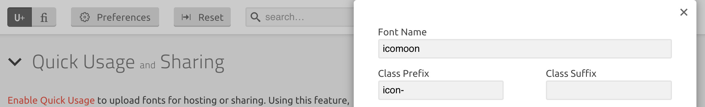

# Wagtail Icons

[](https://pypi.python.org/pypi/wagtail-icons/)

## Requirements

- Python 3
- Django >= 2
- Wagtail >= 3

## Installation

Install the package

```
pip install wagtail-icons
```

Add `wagtail_icons` to your `INSTALLED_APPS`

```python
INSTALLED_APPS = [
    ...
    "wagtail_icons",
]
```

Pick your icon set(s):

```python
WAGTAIL_ICON_SETS = [
    "wagtail_icons.contrib.fontawesome.FontAwesome5",
]
```

## Supported icon sets

| Name | Setting |
|------|---------|
| Font Awesome 5(.15.14) | `wagtail_icons.contrib.fontawesome.FontAwesome5` |
| Font Awesome 6(.0.0-beta3) | `wagtail_icons.contrib.fontawesome.FontAwesome6` |
| IcoMoon | `wagtail_icons.contrib.fontawesome.IcoMoon` |

* Font Awesome 5 
* Font Awesome 6
* IcoMoon (for custom icon sets)

## IcoMoon

If you use the `IcoMoon` iconset please make sure you copy your custom icomoon files to the following directory:

```
static/wagtail_icons/icomoon/style.css
static/wagtail_icons/icomoon/fonts/icomoon.eot
static/wagtail_icons/icomoon/fonts/icomoon.svg
static/wagtail_icons/icomoon/fonts/icomoon.ttf
static/wagtail_icons/icomoon/fonts/icomoon.woff
```

Tip: if the classnames conflict with the ones from Wagtail (as they use the same `icon-` prefix by default) you can choose to override this setting in the IcoMoon app preferences:



## Create your own icon set

```python
from wagtail_icons.base import BaseIconSet

class MyIconSet(BaseIconSet):
    css_files = []
```
